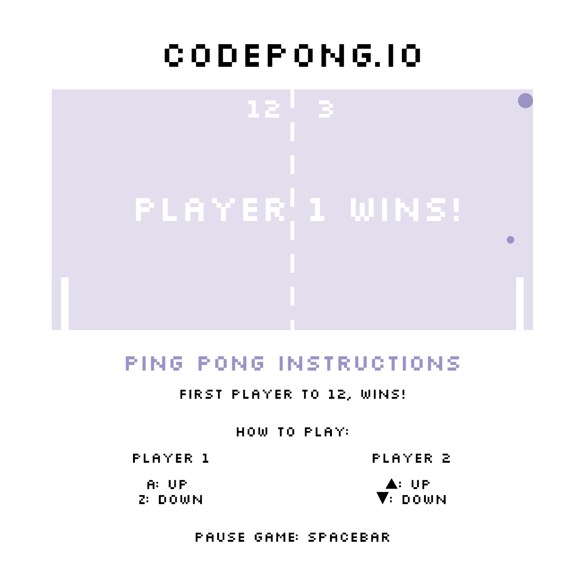

# Pong Game

This project is a basic pong game which taught me how to build SVGs from scratch, and how to implement ES2015 classes. For this project we built the board out of SVGs and compiled ES6 code into ES5 using Babel. 

## Setup

**Install dependencies:**

`> npm i`

**Run locally with Webpack Dev Server:**

`> npm start`

**Build for production:**

`> npm run build`

## Keys

**Player 1:**
* a: up
* z: down

**Player 2:**
* ▲: up
* ▼: down

**Other**
spacebar: pause

# Functionality 

1. Press spacebar to start the game.
2. Upon contact with the paddles, the ball will detect where it hit the paddle and change it's vectors accordingly.
3. The paddles have added smooth movement. The game can detect mutliple keydowns rather than just a single one.
4. There are two balls (1 big, 1 small) to make the game harder for the two players
5. The first player to 12, wins.
